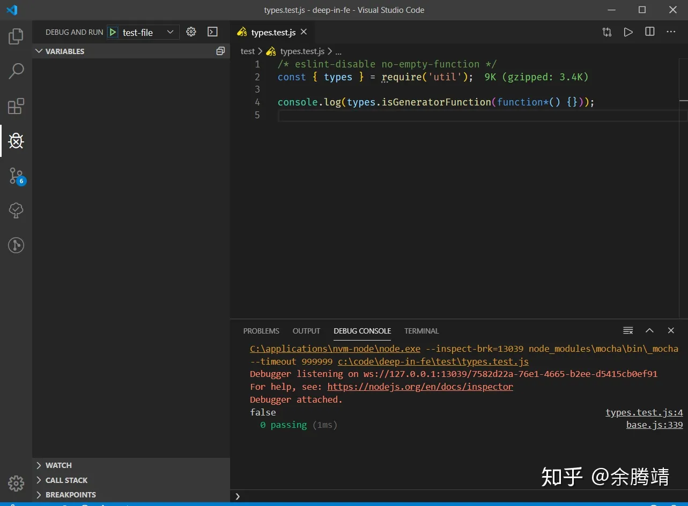

相信到了年底，不少前端都准备找工作跳槽了。而作为春招大军的一员，估计很多准备春招的应届生和我一样这个年过得很焦虑。JavaScript 类型是前端面试中考察 JavaScript 基础的常考知识点，经常性第一个问题就是 JavaScript 中有哪些类型。

笔者今年从春招实习到秋招经历了挺多的面试，也总结了一些规律：一般来讲第一轮面试往往就是考察基础，就算你简历很牛逼那也得走个流程啊。而考察基础一般就按照 HTML，CSS，JavaScript，计算机网络，常见的 web 安全，后端知识如数据库，鉴权，再就是最后来两道算法题或智力题或数学题。

最近几个月我都很少像以前那样一天到晚刷掘金和知乎的文章，基本上就是在开源项目中实战学习，我觉得刚入门前端的人确实需要多看一些优质的博客。**刚入门更需要广度，随后是广度和深度并行，最后才是深度**。其实说人话就是：刚开始入门时因为没怎么写过项目，懂得太少，所以需要多看，被动吸收。到后来有一定广度了，你会发现其实你在写一个项目的时候往往碰到的问题就是因为你的深度不够，这个时候你会更注重深度。最后当你广度慢慢到了一定程度后，由于网络上 99% 的文章都是小白文，你看了标题之后就大概闻的出文章是啥内容，看了对你也没啥用，这个时候你更因该把时间花在一个小的领域，注重深度，深度才是最能体现一个程序员**技术价值**的地方。

前面唠叨了一堆废话，下面正式开始本文内容。本文内容主要分两部分：

1. 总结 JavaScript 中各种类型一些值得注意的地方，小技巧和个人心得
2. JavaScript 如何进行类型判断

<!-- more -->

## JavaScript 中的各种类型

JavaScript 中类型主要分两大类：**基本类型** 和 **对象类型**。

基本类型又分 string，number，boolean，undefined，null，symbol，bigInt 七种，ES 以前只有前 5 种基本类型，ES6 往后新增了 symbol 和 bigInt。

对象类型又叫引用类型，除了基本类型就是对象类型，纯对象，标准对象实例，函数等都是对象类型。

前面说了那么多种类型，那么它们各自有什么特点呢？

### string

在 js 里面表示一个字符串字面量有三种方式，单引号，双引号，或者反引号，反引号表示法又叫模板字符串，是 ES6 的新语法：

```javascript
'使用单引号表示字符串';
// prettier-ignore
"使用双引号表示字符串";
`使用模板字符串表示字符串`;
```

如果你要在字符串里面插入单引号或者双引号可以使用反引号：

```javascript
`I'm a programer, "_"!`;
// prettier-ignore
'单引号字符串可以插入反引号`';
```

如果你和我一样喜欢用单引号表示字符串，你会发现，基本上没有什么场景需要使用双引号，使用双引号的时候例如要在字符串中插单引号那可以使用模板字符串代替。

使用模板字符串有一些要注意的地方，一个是两个反引号内任意字符串都有效，下面的字符串输出的是 4，最前面一个空格，a，换行符，最后的空格，所以总共长度为 4：

```javascript
// prettier-ignore
console.log(` a
 `.length); // => 4
```

另一个问题是当模板字符串插入对象时并不会被转换成 JSON 字符串，下面两条语句输出的结果是不一样的：

```javascript
const obj = { author: 'YuTengjing' };
console.log(obj); // => { author: 'YuTengjing' }
console.log(`${obj}`); // => [object Object]

// 应该使用
console.log(`${JSON.stringify(obj)}`); // => {"author":"YuTengjing"}
```

模板字符串前面还可以带标签，例如使用 String.row 来获取原始字符串：

```javascript
console.log(String.raw`aaa\n\\`); // => aaa\n\\
```

带标签的模板字符串本质上就是函数调用，看 MDN 上的一个例子就懂了：

```javascript
var person = 'Mike';
var age = 28;

function myTag(strings, personExp, ageExp) {
  var str0 = strings[0]; // "that "
  var str1 = strings[1]; // " is a "

  // There is technically a string after
  // the final expression (in our example),
  // but it is empty (""), so disregard.
  // var str2 = strings[2];

  var ageStr;
  if (ageExp > 99) {
    ageStr = 'centenarian';
  } else {
    ageStr = 'youngster';
  }

  return str0 + personExp + str1 + ageStr;
}

var output = myTag`that ${person} is a ${age}`;

console.log(output);
// that Mike is a youngster
```

其实有一些开源的模板引擎就利用到了标签模板字符串的，例如 [hyperx](https://github.com/choojs/hyperx)：

```javascript
var vdom = require('virtual-dom');
var hyperx = require('hyperx');
var hx = hyperx(vdom.h);

var title = 'world';
var wow = [1, 2, 3];
var tree = hx`<div>
  <h1 y="ab${1 + 2}cd">hello ${title}!</h1>
  ${hx`<i>cool</i>`}
  wow
  ${wow.map(function (w, i) {
    return hx`<b>${w}</b>\n`;
  })}
</div>`;
console.log(vdom.create(tree).toString());

/* =>
<div>
  <h1 y="ab3cd">hello world!</h1>
  <i>cool</i>
  wow
  <b>1</b><b>2</b><b>3</b>
</div>
*/
```

模板字符串说了这么多，那么什么时候应该使用模板字符串什么时候使用单引号呢？其实总结一下就是以下情况使用模板字符串：

1. 需要拼接表达式
2. 写多行字符串字面量
3. 需要在字符串中插入单引号和双引号的时候

其它情况使用单引号即可。

### number

之前和一个同学聊前端的时候，我考了下他 NaN 是什么类型，它居然跟我说不知道...

NaN 其实属于 number 类型：

```javascript
console.log(typeof NaN); // => number
```

JavaScript 中没有整数和小数之分，统一叫做 number 类型，所以 `5 / 2` 不会像很多其它语言一样等于 2。另外 JavaScript 的数字类型是遵循 IEEE（跟我一起读：I triple E）754 64 位浮点标准的，因此它也有浮点数精度问题：

```javascript
console.log(0.1 + 0.2 === 0.3); // => false
```

对于精度问题我们一般简单处理就是判断误差范围是否小于精度要求：

```javascript
const result = 0.1 + 0.2;
console.log(result); // => 0.30000000000000004
// 精度要求误差小于 1 亿分之一
const isEqual = result - 0.3 < 1e-8;
console.log(isEqual); // => true
```

如果频繁处理精度问题或者要求精度要求比较高这个时候就要考虑使用第三方库如 [math.js](https://github.com/josdejong/mathjs) 或者可以使用 bigInt。

面试常考下面这个问题：

#### 如何判断一个数是不是 NaN？可不可以用等于号判断？

其实面试官问你可不可以就是告诉你不可以，面试黑话之一ㄟ ( ▔, ▔ ) ㄏ。

使用等号判断是不行滴：

```javascript
const value = 1 / 'a';
console.log(value); // => NaN
console.log(value === NaN); // => false
```

判断一个数是不是 NaN，一般来说用 isNaN 即可。

```javascript
console.log(isNaN(NaN)); // => true
console.log(isNaN(true)); // => false
console.log(isNaN('123')); // => false
console.log(isNaN('aaa')); // => true
```

注意最后这个判断，这个结果其实有点反直觉的：'aaa' 并不是 NaN，应该返回 false 啊。其实 isNaN 也就是 window.isNaN 在判断传入的值是不是 NaN 是会先将其转换成数字，再判断结果是不是 NaN，也就是说 isNaN('aaa') 等价于 isNaN(Number('aaa'));

除了使用 window.isNaN，ES6 在数字类型构造函数 Number 上新增了一个方法 Number.isNaN，它和 window.isNaN 的区别在于：Number.isNaN 只有在传递的值就是 NaN 时才返回 true，不会先转换成数字再比较，也就是说这个 API 就是用来计算一个值是不是就是 NaN。拿一个非数字符串一比较区别就很明显了：

```javascript
const value = 'aaa';

console.log(isNaN(value)); // => true
// 等同于
const transformedNumber = Number(value);
// 转换后就等于 NaN 了
console.log(transformedNumber); // => NaN
console.log(Number.isNaN(transformedNumber)); // => true

// 只有 value 就是 NaN 才会返回 true
console.log(Number.isNaN(value)); // => false
```

#### 取整

取整是平时开发时经常会碰到的问题之一，其实 js 里面取整方法有很多，标准对象 Math 就自带了一堆取整函数：

```javascript
// 向下取整
console.log(Math.floor(2.6)); // => 2
// 向上取整
console.log(Math.ceil(6.1)); // => 7
// 四舍五入
console.log(Math.round(0.4)); // => 0
console.log(Math.round(0.5)); // => 1
// 纯粹的取整，不要小数部分
console.log(Math.trunc(0.6)); // => 0
console.log(Math.trunc(0.4)); // => 0
console.log(Math.trunc(-0.8)); // => 0
```

因为 JavaScript 这门语言非常奇葩和灵活，所以常常能看到各种闻所未闻的奇淫技巧：

```javascript
console.log(1.5 >> 0); // => 0
console.log(1.5 >>> 0); // => 0
console.log(1.5 << 0); // => 0
console.log(1.5 ^ 0); // => 0
console.log(1.5 | 0); // => 0
console.log(~~1.5); // => 0
```

其实还是不建议大家使用上面的这些技巧，主要还是可读性不好，表达式一复杂几天后再看代码一眼懵逼。不过事实情况是大家开会时说不能写这些乱七八糟的骚操作，但是私底下都偷偷的用....

我用的比较多的还是 `~~` 和 `|` 来取整，根据你表达式的执行顺序和它们的优先级合理选择：

```javascript
// ~~ 适合立即取整
console.log(~~1.4);
// | 优先级比较低，如果你取整之前有表达式建议使用这种方式
console.log((1.4 + 2.8) | 0);
```

可以看一下 [superagent](https://github.com/visionmedia/superagent) 这个著名的请求库如何处理 status 和一些标记的：

```javascript
var type = (status / 100) | 0;

// status / class
res.status = status;
res.statusType = type;

// basics
res.info = 1 == type;
res.ok = 2 == type;
res.clientError = 4 == type;
res.serverError = 5 == type;
res.error = 4 == type || 5 == type;
```

#### 千分位问题

##### 使用 Number.prototype.toLocaleString

```javascript
console.log((123456.123456).toLocaleString()); // => 123,456.123
```

##### 使用国际化 API

```java
console.log(new Intl.NumberFormat('en-US').format(123456.123456)); // => 123,456.123
```

##### 使用正则

```javascript
// 先行断言
function formatRegExp1(number) {
  var pattern = /(?=(\B\d{3})+\.)/g;
  return number.toFixed(2).toString().replace(pattern, ',');
}
```

#### 表示不等于 -1

在 koa 的源码里面有这么个函数：

```javascript
/**
   * Check if the request is idempotent.
   *
   * @return {Boolean}
   * @api public
   */

  get idempotent() {
    const methods = ['GET', 'HEAD', 'PUT', 'DELETE', 'OPTIONS', 'TRACE'];
    return !!~methods.indexOf(this.method);
  },
```

搞懂这个判断幂等性的函数之前我们先来研究下 ~num 也就是位非操作符有什么规律：

```javascript
console.log(~2); // -3
console.log(~1); // => -2
console.log(~0); // => -1
console.log(~-1); // => 0
console.log(~-2); // => 1
console.log(~-3); // => 2
```

看完上面的测试我们发现规律就是：对于 ~num，如果 num 时正整数，结果就是等于 -(num + 1)，也就是把加一后的结果取负。如果是负整数，结果就是 num + 1，也就是加一。并且只有当 num 等于 -1， ~num 结果等于 0。这是存粹从计算的角度发现的规律。

现在我们尝试把它们的结果转换成 boolean 类型再来康康：

```javascript
console.log(Boolean(~2)); // true
console.log(Boolean(~1)); // => true
console.log(Boolean(~0)); // => true
// ~1 取 boolean 为 false
console.log(Boolean(~-1)); // => false
console.log(Boolean(~-2)); // => true
console.log(Boolean(~-3)); // => true
```

发现了没，因为只有当 num 等于 -1 的时候， ~num 的值才等于 0，而对于 Boolean(value) 函数而言，只有 value 是 0 才返回 false，其它值即便是负数也返回 true。所以我们可以通过 ~num 表示 num 不等于 -1。

至于前面的 `!!` 其实就是两次 boolean 取反也就是取 boolean 值，等同于 Boolean(~methods.indexOf(this.method))。

### boolean

布尔类型只有两个值 true/false。JavaScript 的类型转换充分体现 JavaScript `灵活性`（艹蛋），虽然 js 底层可能做了很多层转换，但是对于我们平时的开发而言，不需要去了解的那么精细，了解其大致转换规律即可。举个例子来说：

```javascript
0 == []; // true
```

看起来很简单的一个非严格相等比较，其实要获得最终结果是要经历很多步：

1. 因为和 number 比较，需要将 [] 转换成原始值，调用 [].valueOf(), 返回 []，不是原始值
2. 尝试使用 [].toString() 获取原始值，返回空字符串 `''`，此时，变成 number 类型和 string 类型比较
3. 将 `''` 转换成 number 类型，Number('') 返回 0
4. 最后 0 和 0 比较相等

其实平时不用像上面那样一步一步判断，非数字类型和数字类型比较基本上就是将非数字类型转换成数字后再比较，中间步骤不用去想，用 Number([]) 转换一下，结果返回 0，比较一下不就是了。

下面来看看其它类型转换成 boolean 类型是上面结果：

```javascript
console.log(Boolean(0)); // false
console.log(Boolean(1)); // true
console.log(Boolean(-1)); // true
console.log(Boolean(NaN)); // false
console.log(Boolean([])); // true
console.log(Boolean({})); // true
console.log(Boolean()); // false
console.log(Boolean('')); // false
console.log(Boolean(' ')); // true
console.log(Boolean(undefined)); // false
console.log(Boolean(null)); // false
```

在考虑转换成 boolean 类型时不需要去考虑内部的每一步转换，只要记住一个规律即可：那些消极的值一般会转换成 false，积极的值一般转换成 true, 对象一定会转换成 true，负数也会转换成 true。

> 如果一个值在转换成 boolean 类型时值为 false，那么我们称这个值是 **falsy** 的。

既然聊 boolean 类型，那么顺便说说 JavaScript 中的相等性判断。

#### 相等性判断

之前面试的时候碰到过这样一道题：

```javascript
console.log(666 == new Number(666));
```

这道题的结果是 true，比较过程其实是：

1. 右侧是 number 对象，数字类型和对象类型比较先把对象转成数字，调用 valueOf 方法，返回 666
2. 666 和 666 相等

其实在 js 里相等性判断其实有三种不同的值比较操作：

- 严格相等 ("triple equals" 或 "identity")，使用 [===](https://developer.mozilla.org/en-US/docs/Web/JavaScript/Reference/Operators/Comparison_Operators#Identity) ,
- 宽松相等 ("double equals") ，使用 [==](https://developer.mozilla.org/en-US/docs/Web/JavaScript/Reference/Operators/Comparison_Operators#Equality)
- 以及 [`Object.is`](https://developer.mozilla.org/en-US/docs/Web/JavaScript/Reference/Global_Objects/Object/is) （ECMAScript 2015/ ES6 新特性）

我们平时开发应该尽量使用 === 而不是 ==，因为 === 结果更加直观，更符合预期，只有严格相等才会返回 true。而使用 ==，你还要思考一下各种类型转换的情况。

前面两个我就不多说了，相信大家都非常清楚它们的区别了，就是 == 会在比较时做类型转换，而 === 不会。至于第三个 Object.is，我们看几个测试就知道它的特点了：

```javascript
console.log(0 === -0); // true
console.log(NaN === NaN); // false

console.log(Object.is(0, -0)); // false
console.log(Object.is(NaN, NaN)); // true
```

它和 === 也就是严格等的区别就在于 0 不等于 -0，NaN 和 NaN 是相等的。如果你问我 Object.is 有什么用，反正我觉得没什么卵用。

#### !! 是什么鬼

在搞清楚 !! 之前，我们先探究下 `!`，学过编程的都知道，! 是逻辑运算符，功能是取反。

```javascript
console.log(!true); //=> false
console.log(!false); // => true
```

那么当 ! 后面跟着的操作数不是 boolean 类型会发生什么呢？稍微有点灵性就能猜出来是先将其转换成 boolean 值，再取反。看测试结果：

```javascript
console.log(Boolean(0)); // false
console.log(!0); // true

console.log(Boolean(1)); // true
console.log(!1); // false

console.log(Boolean(-1)); // true
console.log(!-1); // false

console.log(Boolean(NaN)); // false
console.log(!NaN); // true

console.log(Boolean([])); // true
console.log(![]); // false

console.log(Boolean({})); // true
console.log(!{}); // false

console.log(Boolean('')); // false
console.log(!''); // true

console.log(Boolean(' ')); // true
console.log(!' '); // false

console.log(Boolean(undefined)); // false
console.log(!undefined); // true

console.log(Boolean(null)); // false
console.log(!null); // true
```

测试结果证明了我们的猜想是对的。既然一次 ! 是将操作数转换成 boolean 再取反，那么再来一次取反，就是负负得正，其实就是转换成 boolean 值嘛。使用 `!!var` 比起 `Boolean(var)` 方便多了。

### undefined 和 null

**undefined 类型只有 undefined 一个值，null 类型同样也只有 null 一个值**。这俩放一起说是因为它俩实在是太像了，我感觉很多人甚至认为他俩没区别。

个人认为它们还是有区别的，从语义的角度来说：undefined 表示一个变量被声明了但是没被赋值，而 null 表示获取不到值，一般是你刻意设置的空值，具体表现就是设置函数返回值时如果获取不到值的时候我们往往是返回 null，而不会返回 undefined。

有些人可能会下意识认为 `false == null`，事实却是：

```javascript
console.log(false == null); // false
console.log(undefined == null); // true
```

事实上只有 undefined 和 null 才会和 null 非严格等，false 也不行，所以当你看到有人使用 if (val == null) 时应该要知道它是在判断 val 是不是等于 undefined 或者 null，而不是判断是不是 falsy。

### symbol

symbol 我感觉平时写项目可能不太用得上，但是在写库或者设计框架的时候还是能派上用场的，例如我在实现完全符合 A+ 规范的 [MyPromise](https://github.com/tjx666/deep-in-fe) 的时候就用 Symbol 来表示状态枚举值。

symbol 和后面要说的 bigInt 一样，**不能使用 new 来构造值**。获取一个 symbol 值只能通过 Symbol(description) 或者 Symbol.for(key)：

```javascript
const s1 = Symbol('mark');
const s2 = Symbol('mark');
console.log(typeof s1); // => symbol
console.log(s1); // => Symbol(mark)
console.log(s1 === s2); // => false
console.log(Symbol.for('key') === Symbol.for('key')); // => true
```

symbol 最大的特点便是唯一性，每次通过 Symbol 返回的都是 js 内部计算好的一个 唯一的 symbol 值。除了唯一性，symbol 类型的值还能作为对象的键，这在 ES5 时代是只有字符串类型。有些人可能认为 number 也能作为对象的键，一个显而易见的例子便是数组，事实真的是这样吗？

```javascript
const arr = [1, 2, 3];
console.log(typeof Object.keys(arr)[0]); // => string
```

那么 symbol 有什么用呢？最大的用途其实还是作为对象的属性使用。使用 symbol 值定义属性，好处就是：**防止用户修改内部属性**。事实上 js 内部有很多属性都是使用 symbol 值定义的，这些属性大多直接绑定到 Symbol 函数上，例如 `Symbol.toPrimitive`，对象的`Symbol.toPrimitive`属性，指向一个方法。该对象被转为原始类型的值时，会调用这个方法，返回该对象对应的原始类型值。

`Symbol.toPrimitive`被调用时，会接受一个字符串参数，表示当前运算的模式，一共有三种模式。

- Number：该场合需要转成数值
- String：该场合需要转成字符串
- Default：该场合可以转成数值，也可以转成字符串

```javascript
let obj = {
  [Symbol.toPrimitive](hint) {
    switch (hint) {
      case 'number':
        return 123;
      case 'string':
        return 'str';
      case 'default':
        return 'default';
      default:
        throw new Error();
    }
  },
};

2 * obj; // 246
3 + obj; // '3default'
obj == 'default'; // true
String(obj); // 'str'
```

除了定义属性，我觉得还可以用于搭配对象实现枚举。因为 js 没有枚举这种类型，所以我们只能模拟了，使用 symbol 可以模拟一个更 perfect 的枚举，让枚举值不可能会重复，还能避免使用 switch/case 的时候由于枚举值相等造成逻辑 bug。

```javascript
// 枚举的特点：不能重复，不能被修改
// 这个版本更好理解
const Season = Object.freeze({
  SPRING: Symbol('season-spring'),
  SUMMER: Symbol('season-summer'),
  AUTUMN: Symbol('season-autumn'),
  WINTER: Symbol('season-winter'),
});

Season.SPRING = 666;
console.log(Season.SPRING); // => Symbol(season-spring)
// 枚举值不能重复
console.log(Season.SPRING === Season.SUMMER); // => false

// 更完善的实现，枚举应该是不能被修改的，这里使用了 ES6 的 proxy
const Season = new Proxy(
  {
    SPRING: Symbol('season-spring'),
    SUMMER: Symbol('season-summer'),
    AUTUMN: Symbol('season-autumn'),
    WINTER: Symbol('season-winter'),
  },
  {
    set() {
      throw new Error(`can't modify enumeration Season`);
    },
  },
);

// Season.SPRING = 666; // => can't modify enumeration Season
console.log(Season.SPRING); // => Symbol(season-spring)
console.log(Season.SPRING === Season.SUMMER); // => false
```

### bigInt

看一道 leetcode 题：


这道题我不假思索的就写下了下边的答案：

```javascript
/**
 * @param {number[]} digits
 * @returns {number[]}
 */
function plusOne(digits) {
  return `${Number(digits.join('')) + 1}`.split('');
}
```

结果提交的时候出错了：


出错的原因很简单，因为测试的数据大于 js 最大安全整数了，出现了精度丢失：

```javascript
const num = Number([6, 1, 4, 5, 3, 9, 0, 1, 9, 5, 1, 8, 6, 7, 0, 5, 5, 4, 3].join(''));
console.log(num); // => 614 5390 1951 8670 5000
console.log(num > Number.MAX_SAFE_INTEGER); // => true
console.log(Number.MAX_SAFE_INTEGER); // => 9007 1992 5474 0991
```

换成 BigInt 来试试：

```javascript
/**
 * @param {number[]} digits
 * @returns {number[]}
 */
function plusOne(digits) {
  return `${BigInt(digits.join('')) + 1n}`.split('');
}
```

这次就顺利通过了所有测试：


这里来说点题外话，笔者最近在刷 leetcode，因为很多题其实有很多解法，有时我就会拿 [benchmark.js](https://github.com/bestiejs/benchmark.js) 来去测试不同解法的效率。不过，测着测着。我就发现：**使用 JavaScript 测试不同的算法效率很扯淡**。来看一个具体的例子，leetcode 26 题，删除重复元素。

解法一：两层循环，算法复杂度：O(n²)

```javascript
// removeDuplicates1
function removeDuplicates(nums) {
  if (nums.length < 2) return nums.length;

  let i = 1;
  while (i < nums.length) {
    if (nums[i] === nums[i - 1]) {
      for (let j = i; j < nums.length; j++) {
        nums[j - 1] = nums[j];
      }
      nums.length--;
    } else {
      i++;
    }
  }

  return nums.length;
}
```

解法二：快慢双指针，一次遍历即可，算法复杂度 O(n)

```javascript
// removeDuplicates2
function removeDuplicates(nums) {
  const { length } = nums;
  if (length === 0) return 0;

  let head = 0;
  for (let tail = 1; tail < length; tail++) {
    if (nums[tail] !== nums[head]) {
      head++;
      nums[head] = nums[tail];
    }
  }

  const resultLength = head + 1;
  nums.length = resultLength;

  return resultLength;
}
```

我拿最能发挥双指针优势的情况，也即是大量重复元素的情况来测试测试：

```javascript
const { Suite } = require('benchmark');

const removeDuplicates1 = require('../src/0026-Remove Duplicates from Sorted Array/removeDuplicates1');
const removeDuplicates2 = require('../src/0026-Remove Duplicates from Sorted Array/removeDuplicates2');

const testArr = [...Array(1e5)].map(() => 6);

new Suite()
  .add('removeDuplicates1', function () {
    removeDuplicates1(testArr);
  })
  .add('removeDuplicates2', function () {
    removeDuplicates2(testArr);
  })
  .on('cycle', function (event) {
    console.log(String(event.target));
  })
  .on('complete', function () {
    console.log(`Fastest is ${this.filter('fastest').map('name')}`);
  })
  .run({ async: true });
```

结果出人意料，还特么是算法一效率高

```plaintext
/* =>
removeDuplicates1 x 94,495,506 ops/sec ±1.94% (83 runs sampled)
removeDuplicates2 x 11,855,308 ops/sec ±3.34% (84 runs sampled)
Fastest is removeDuplicates1
 */
```

所以我觉得吧，在写 JS 的时候，我们一般情况都不需要去考虑算法效率，去重我用 Set 难道不香吗？虽然这个解法不符合 leetcode 的题目要求。

```javascript
const removeDuplicates = (nums) => [...new Set(nums)];
```

其是也就是常说的不要过早的优化，即便是真需要算法进行优化的时候，我们也应该需要对实际效果测试之后再决定是否优化，理论和实际还是有很大区别的，现实情况往往想像的要复杂的多。

## JavaScript 类型判断

先归纳一下常见的判断方法：

1. typeof
2. instanceof
3. Object.prototype.toString
4. 比较构造器
5. 比较对象的属性
6. 原生 API
7. 直接比较值是否等于你要判断的值

下面一个一个来说说它们的各自适合的使用场景和优缺点。

### typeof

当你需要判断一个变量的类型的时候，首先应该想到的是就是能不能用 typeof 来判断。为什么？因为 typeof 比其它的方式更安全：

```javascript
console.log(typeof abc); // => undefined
console.log(def instanceof Object); // 报错：ReferenceError: def is not defined
```

当你对一个没有声明过的变量进行判断时，使用 typeof 相比与 instanceof 等其它方法更安全，使用 typeof 只会返回 undefined，而其它方式直接报错了。

但是 typeof 绝对安全吗？No，碰到暂时性死区照样歇菜：

```javascript
function test() {
  console.log(typeof a); // ReferenceError: Cannot access 'a' before initialization
  const a = 666;
}

test();
```

再给 typeof 适合哪些情况下结论之前我们先来测试一下 typeof 的特性：

```javascript
console.log(typeof 6); // => number
console.log(typeof '6'); // => string
console.log(typeof true); // => boolean
console.log(typeof undefined); // => undefined
console.log(typeof Symbol('6')); // => symbol
console.log(typeof BigInt(6)); // => bigint
console.log(typeof {}); // => object
console.log(typeof []); // => object

console.log(typeof null); // => object
console.log(typeof function () {}); // => function

console.log(typeof Number(6)); // => number
console.log(typeof new Number()); // => object
console.log(typeof new Boolean(false)); // => object
```

值得注意的是最后两组测试，前面的测试都比较符合预期，也就是说 typeof 对基本类型使用时会返回它的类型字符串。出乎意料的是 typeof null 居然也返回 object，还有 typeof 函数时返回的是 function，讲道理应该返回 null 和 object 才对。

最后一组测试的结果表面当我们 new 基本类型的构造函数的时候返回的是它们的包装类实例，也就是对象类型。

根据测试结果我们可以下结论：**typeof 适合判断除了 null 以外的基本类型和函数类型，也可以用于判断是否为对象类型，不适合判断是否为某种类的实例。**

其实 typeof 还是比较万能的，当我们在开发时需要类型判断时，可以先考虑下能不能使用 typeof 来判断。我们来实现一个判断是否为 number 的工具函数：

```javascript
function isNumber(val) {
  return typeof val === 'number';
}
```

好像挺简单的，实测一下：

```javascript
console.log(isNumber(6)); // => true
console.log(isNumber(new Number(6))); // => false
```

你会发现当 val 是数字对象的时候就返回 false 了，因为 typeof new Number(6) 返回的是 'object'，如果要求 isNumber 兼容数字对象怎么办？

### instanceof

我们知道在 js 中很多类型的对象可以通过 new constructor() 的方式来构造对象，**如果你需要判断一个变量是否是某个类的实例，就可以用 instanceof 来判断**：

instanceof 的原理很简单：

```javascript
const isObject = require('../is/isObject');

function instanceOf(obj, constructor) {
  if (!isObject(constructor)) {
    throw new TypeError(`Right-hand side of 'instanceof' is not an object`);
  } else if (typeof constructor !== 'function') {
    throw new TypeError(`Right-hand side of 'instanceof' is not callable`);
  }

  return constructor.prototype.isPrototypeOf(obj);
}
```

涉及到的其它代码保存在[instanceof 运算符原理](https://github.com/tjx666/deep-in-fe/blob/master/src/instanceof)。主要是最后一句 `constructor.prototype.isPrototypeOf(obj)`，也就是对于 obj instanceof constructor，返回的就是 constructor 的原型是否在 obj 的原型链上。

下面的测试结果表明 instanceof 不能用于判断基本类型：

```javascript
console.log(1 instanceof Number); // => false
console.log(Symbol() instanceof Symbol); // => false
console.log(BigInt(5) instanceof BigInt); // => false
```

现在我们来完善一下之前的 isNumber 函数：

```javascript
function isNumber(val) {
  return typeof val === 'number' || val instanceof Number;
}

console.log(isNumber('123')); // => false
console.log(isNumber(true)); // => false
console.log(isNumber(null)); // => false
console.log(isNumber({})); // => false

console.log(isNumber(1)); // => true
console.log(isNumber(Object(1))); // => true
console.log(isNumber(new Number(555))); // => true
```

测试成功。

### Object.prototype.toString

我们看看 lodash 它的 isNumber 是怎么实现的：

```javascript
function isNumber(value) {
  return typeof value === 'number' || (isObjectLike(value) && getTag(value) == '[object Number]');
}
```

再贴一下 isObjectLike 和 getTag 的源码：

```javascript
function isObjectLike(value) {
  return typeof value === 'object' && value !== null;
}
```

```javascript
const toString = Object.prototype.toString;

function getTag(value) {
  if (value == null) {
    return value === undefined ? '[object Undefined]' : '[object Null]';
  }
  return toString.call(value);
}
```

很好理解，isObjectLike 就是判断一个变量是否是非函数对象，getTag 就是封装了一下 Object.prototype.toString，让它也能处理 value 等于 undefined 或者 null 的时候。

那么 Object.prototype.toString 是干嘛用的呢，看几个测试：

```javascript
const toString = Object.prototype.toString;

console.log(toString.call(1)); // => [object Number]
console.log(toString.call(true)); // => [object Boolean]
console.log(toString.call(null)); // => [object Null]
console.log(toString.call(undefined)); // => [object Undefined]
console.log(toString.call({})); // => [object Object]
console.log(toString.call(new Date())); // => [object Date]
console.log(toString.call(/e/)); // => [object RegExp]

function Foo() {}
console.log(toString.call(new Foo())); // => [object Object]

function Bar() {
  this[Symbol.toStringTag] = '自定义的 tag';
}
console.log(toString.call(new Bar())); // => [object 自定义的 tag]
```

一般来说所有的对象的原型链往上追溯最后都会到 Object.prototype，所以你可以在任意对象上调用 toString 方法。为什么 lodash 在 getTage 中还特意处理了下 value 是 null 或者 undefined 的情况呢？参考 [MDN](https://developer.mozilla.org/zh-CN/docs/Web/JavaScript/Reference/Global_Objects/Object/toString) 的说明：

> **Note:** Starting in JavaScript 1.8.5, `toString()` called on [`null`](https://developer.mozilla.org/en-US/docs/Web/JavaScript/Reference/Global_Objects/null) returns `[object Null]`, and [`undefined`](https://developer.mozilla.org/en-US/docs/Web/JavaScript/Reference/Global_Objects/undefined) returns `[object Undefined]`, as defined in the 5th Edition of ECMAScript and subsequent Errata.
>
> See [Using `toString()` to detect object class](https://developer.mozilla.org/en-US/docs/Web/JavaScript/Reference/Global_Objects/Object/toString#Using_toString_to_detect_object_class).

也就是说在早期版本的 js 中 toString.call(null) 不会返回 `[object Null]`。我们还可以使用 Symbol.toStringTag 属性来定义对象的 stringTag。为什么我们不直接拿变量的 toString 函数返回值去比较而是要用 Object.prototype.toString.call(value) 去绑定对象原型的 toString 函数的 this 到变量上，这样来获取 stringTag 呢？原因其实很简单，一方面大多数类型都重写了自己的 toString 函数，例如 Date 返回的就是本地时间字符串而不是 [object Date]，另一方面是因为直接对 null 或 undefined 调用 toString 会报错。

```javascript
console.log({}.toString()); // => [object Object]
console.log(new Date().toString()); // => Wed Jan 15 2020 16:03:59 GMT+0800 (GMT+08:00)
console.log(new RegExp(/e/).toString()); // => /e/
console.log(null.toString()); // Cannot read property 'toString' of null
```

现在再来看 lodash 实现的 isNumber 就很好理解了，就是先用 typeof 来判断是不是 number 类型，再用 isObjectLike 和 getTag 判断是不是 number 对象。

### 比较构造器

**通过直接比较对象得构造器是不是等于某个构造器也可以用来做类型判断**，笔者前不久在看 [co](https://github.com/tj/co/blob/master/index.js) 源码的时候看到它定义了好几个类型判断函数，先来看一个简单点的：

```javascript
function isObject(val) {
  return Object == val.constructor;
}
```

这个其实是用来判断 val 是不是纯对象的，也就是使用对象字面量和 new Object() 构造的实例。其实单独单独看这个函数是设计的有问题的，当 val 是 undefined 或 null 就会出错。但是这只是我摘得部分代码，真正源码上下文，这个 val 是不会等于 null 或 undefined 的，希望读者不要误解。

### 比较对象的属性

再来看 co 源码中另外两个个稍微复杂的类型判断：

```javascript
function isGenerator(obj) {
  return 'function' == typeof obj.next && 'function' == typeof obj.throw;
}

function isGeneratorFunction(obj) {
  var constructor = obj.constructor;
  if (!constructor) return false;
  if ('GeneratorFunction' === constructor.name || 'GeneratorFunction' === constructor.displayName)
    return true;
  return isGenerator(constructor.prototype);
}
```

先看第一个函数，判断一个对象是否是生成器对象，生成器我们知道，生成器函数返回的对象就是生成器对象：

```javascript
function* gen() {}

const genObj = gen();

console.log(typeof genObj.next); // => function
console.log(typeof genObj.throw); // => function
```

由于生成器对象都有 next 和 throw 函数，因此我们可以根据这点来判断一个对象是不是生成器对象。类似的应用像是判断一个对象是不是 promise，可以简单使用有没有 then 函数来判断。

```javascript
function isPromise(obj) {
  return 'function' == typeof obj.then;
}
```

接着再看看第二个函数 isGeneratorFunction，看名字就知道是用来判断一个对象是不是生成器函数，其实也是**利用对象特有属性来判断类型**。我们知道构造器都是函数，然后函数有 name 属性和 displayName 属性，对于生成器函数来说，生成器函数的 name 固定是 `GeneratorFunction`。displayName 是一个非标准属性，这个属性表示设计者对于函数名的定义。所以这里就是简单判断了传入的对象的构造器的名称是否是 `GeneratorFunction`，如果不是再判断它的原型是不是生成器对象，不过我也没搞明白最后为什么要有最后这个判断。


### 原生 API

关于类型判断，面试常问的除了 NaN，还有就是数组如何判断。其实 JS 本身就自带了一些类型判断 API，判断数组可以直接用 Array.isArray：

```javascript
console.log(Array.isArray({ length: 6 })); // false
function test() {
  console.log(Array.isArray(arguments)); // false
}
test(1, 2);
console.log(Array.isArray([])); // true
```

相对于浏览器环境，node 的 `util` 模块真的是贴心多了：

```javascript
const { types } = require("util");

console.log(types.isPromise(Promise.resolve()));
console.log(types.isProxy(new Proxy({}, {})));
console.log(types.isGeneratorFunction(function*(){}));
console.log(types.isGeneratorObject(function*(){}()));
console.log(types.isDate(new Date()));
console.log(types.isSet(new Set()));
console.log(types.isMap(new Map()));
console.log(types.isRegExp(/exp/));
...
// 以上全部返回 true，并且都是 node V10 新增的
```

这里提一下我之前在使用 babel 转码 node 代码发现的一个 bug，就是 `util.types.isGeneratorFunction` 方法在 babel 转码之后判断有问题：



可以看到 debug 控制台输出的是 false。

### 直接比较值是否等于你要判断的值

这个很好理解，例如判断 null 和 undefined，我们就可以用这种方式，看一下 lodash 的 isObject，就是判断不等于 null 且 typeof 返回的是`'object'` 或者 `‘function’`。

```javascript
function isObject(value) {
  const type = typeof value;
  return value != null && (type === 'object' || type === 'function');
}
```

本文的内容就这么多，最近写了两个 VSCode 插件：[view-github-repository](https://github.com/tjx666/view-github-repository) 和 [open-in-external-app](https://github.com/tjx666/open-in-external-app)，以及几个模板项目：[awesome-chrome-extension-boilerplate](https://github.com/tjx666/awesome-chrome-extension-boilerplate), [vscode-extension-boilerplate](https://github.com/tjx666/vscode-extension-boilerplate) 和 [koa-restful-boilerplate](https://github.com/tjx666/koa-restful-boilerplate)。感兴趣不妨去[我的 github 主页](https://github.com/tjx666)逛逛。

最后，快过年了，祝大家新年快乐，2020 事业更上一层楼。

本文为原创内容，首发于[个人博客](http://www.lyreal666.com)，转载请注明出处。
