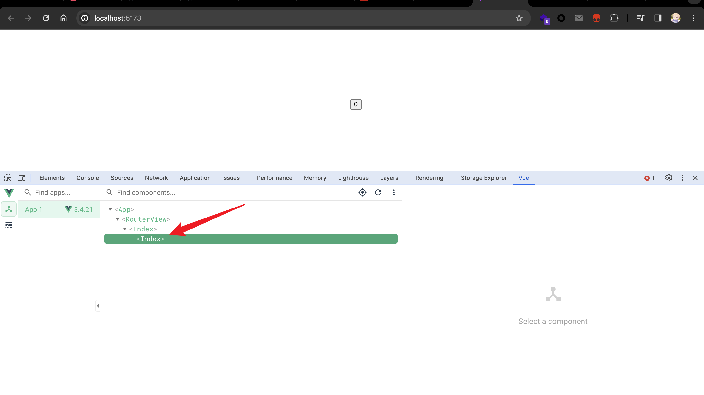

在被裁后准备跑路的最后一周，把一些自己做的工作成果能开源的都给开源了，其中便包括一些[自己写的 eslint 规则](https://github.com/tjx666/eslint-config/tree/main/packages/eslint-plugin/rules)，不然你也看不到这篇文章了。由于深知自己的怠惰，所以我一直坚信一句话：**永远不要高估开发的主观能动性**，能够靠工具自动化的就不要靠开发自觉去做。我是一个对开发效率有极致追求的人，所以在开发日常碰到开发低效的场景总是会尝试使用最舒服，高效的方法去解决它。也因此在上家公司搞前端基建的那段时间，基于自己碰到的问题写了一些 eslint 规则。

## comment-autocorrect

### 问题

其实我刚入行的时候也是喜欢写英文注释的，但是入行经验的增加，越来越看中代码的可维护性，加上对自己的英文的不自信，在开发公司多人维护的项目也慢慢变成只写中文注释了。

我对代码有洁癖，包括中文注释排版，尤其是见不得中英文之间没有空格，于是就像着写个工具来自动对中文注释进行排版。

bad:

```javascript
// loading 过程中禁止全选

/**
 * Loading 过程中禁止全选
 */
```

good:

```javascript
// loading 过程中禁止全选

/**
 * Loading 过程中禁止全选
 */
```

### 技术方案

起初我是觉得应该写个 prettier 插件，因为这个排版优化不会修改逻辑代码，只是做了代码格式化，时间充裕的话我可能会实现为一个 prettier 插件。我觉得当时选择使用 eslint 规则来实现最主要原因：

1. 我对开发 eslint 插件更熟
2. 对这个自动修复不是很自信，当时没怎么使用过现有的一些中文排版工具，觉得排版的效果可能不尽人意，eslint 可以只报错，然后提供 IDE 的重构选项

实现为 eslint 规则很简单，核心思路：

1. 遍历代码 ast 中的注释节点
2. 使用中文排版库对注释内容做排版，如果排版后的内容和之前不一样，report eslint error 并提供自动修复

最开始我选择的中文排版库是 [pangu](https://github.com/vinta/pangu.js)，毕竟 [为什么你们就是不能加个空格呢？](https://chromewebstore.google.com/detail/%E4%B8%BA%E4%BB%80%E4%B9%88%E4%BD%A0%E4%BB%AC%E5%B0%B1%E6%98%AF%E4%B8%8D%E8%83%BD%E5%8A%A0%E4%B8%AA%E7%A9%BA%E6%A0%BC%E5%91%A2%EF%BC%9F/paphcfdffjnbcgkokihcdjliihicmbpd) 这个 chrome 插件经常出现在一些文章的推荐列表里。实际体验效果不太满意，这个库优点是源代码实现很简单，可以跨平台使用，缺点就是很多边际情况没考虑，例如：[函数调用不要加空格](https://github.com/vinta/pangu.js/issues/209)，还有 [有没有办法设置不要对网址进行加空格？](https://github.com/vinta/pangu.js/issues/155)

一番搜索下我了解到一些其它的一些中文排版工具：

- [zhlint](https://github.com/zhlint-project/zhlint) js 编写的中文 lint 工具
- [autocorrect](https://github.com/huacnlee/autocorrect) rust 编写的支持 CJK 语言排版工具

这俩库都有 node api，当时选 autocorrect 主要是看到 user cases 里面有 [MDN Web Docs](https://developer.mozilla.org/zh-CN)，想着应该会比较成熟。此外，相比于 pangu，autocorrect 还支持很多其它排版功能，例如中文句子之间使用英文逗号会修复成中文逗号，是一个功能全面的中文排版工具，甚至作者还搞了个 VSCode 插件：[AutoCorrect](https://marketplace.visualstudio.com/items?itemName=huacnlee.autocorrect)。

其实 autocorrect 是支持对整个文件的代码进行排版的，支持多种编程语言，但是我还是选择只对注释部分进行排版，主要原因是：代码中的中文字符串怎么写往往是设计师定的，很多时候设计师给出的文案就是中英文之间没有空格，这些不能随便改，反倒是注释调整了又不影响代码逻辑。

### 实现

代码很简单，当时项目总共好像几万行代码，直接一次性批量自动修复，抽查了十几个文件包括一些包含 url 地址，代码的注释也能正确的排版。

```typescript
// https://github.com/tjx666/eslint-config/blob/main/packages/eslint-plugin/rules/comment-autocorrect.js

'use strict';

const autocorrect = require('autocorrect-node');

const MESSAGE_ID_DEFAULT = 'default';

/** @type {RuleCreate} */
const create = (context) => {
  const { sourceCode } = context;
  return {
    Program() {
      const comments = sourceCode.getAllComments();
      comments.forEach((comment) => {
        const correctCommentContent = autocorrect.format(comment.value);
        if (correctCommentContent !== comment.value) {
          context.report({
            node: comment,
            messageId: MESSAGE_ID_DEFAULT,
            fix(fixer) {
              return fixer.replaceText(
                comment,
                comment.type === 'Line'
                  ? `//${correctCommentContent}`
                  : `/*${correctCommentContent}*/`,
              );
            },
          });
        }
      });
    },
  };
};

/** @type {RuleModule} */
module.exports = {
  meta: {
    type: 'suggestion',
    schema: [],
    fixable: 'whitespace',
    messages: {
      [MESSAGE_ID_DEFAULT]: '中文注释排版不规范',
    },
  },
  create,
};
```

## prefer-jsdoc

当时维护的项目全面拥抱 typescript，说实话 vue2 我最不能忍受的就是对 typescript 支持不好。

### 问题

由于对项目的 api 不熟，我会习惯性把光标 hover 到变量属性上看类型信息，实际情况一言难尽，项目到处是下面这种代码：

```typescript
interface A {
  name: string; // xxx
}

type A = {
  // xxx
  name: string;
};

// xxx
function a() {}

// xxx
const a = () => {};

// xxx
const a = function () {};

class A {
  name: string; // xxx

  // xxx
  f() {}
}
```

最难顶的是我们那个项目是个编辑器项目。结果那个编辑器项目的 types 包中大量的 interface 的属性全用的单行注释。

js 里的注释可以分为两类：单行注释和多行注释。其中以 `/**` 开头的多行注释又被称为文档注释：jsdoc。tsc 会去解析 jsdoc 并通过 ts lsp 给 VSCode 等 IDE 提供代码补全，描述信息优化开发体验。

像我刚刚说的 interface 属性这种情况，你把它改写成 jsdoc 那样别的地方使用编辑器的属性时就有描述信息，不香吗？

```typescript
interface A {
    /** xxx */
    name: string;
}

type A {
    /** xxx */
    name: string;
}

/**
 * xxx
 */
function a() {}

/**
 * xxx
 */
const a = () => {}

/**
 * xxx
 */
const a = function(){}

class A {
    /** xxx */
    name: string;

    /**
     * xxx
     */
    f() {}
}
```

### 技术方案

如果你只是几处地方需要将单行注释转换成多行注释，其实我更推荐使用 vscode 插件：[jsdoc comment toggler](https://github.com/zachhardesty7/jsdoc-comment-toggler)

但是我们那个项目该改写成 jsdoc 的地方有点多，而且我不认为我在开发群里面喷一下或者分享会上聊一下这个事就能考开发者的自觉去做好这个事。还得是上 linter 强制约束。

核心思路：

1. 确定几种常见的应该将单行注释转换为 jsdoc 的情况，例如 ts 的 interface, type, class, enum 的属性前面和后面的单行注释，函数前面的单行注释
2. 根据不同的情况在对应的 visitor 函数里做检测
3. 在做自动修复时需要将连续多行的单行注释合并为一个 jsdoc，像 interface 属性这种不但需要考虑前面的单行注释，还需要考虑后面的注释
4. 需要忽略像 `// @ts-ignore`, `// eslint-` 之类的工具用注释

#### 实现

代码略微有点长，不过还是个单文件，感兴趣自己[点进去](https://github.com/tjx666/eslint-config/blob/main/packages/eslint-plugin/rules/prefer-jsdoc.js)看吧。

## no-declare-implicit-any-var

### 问题

你可能见过下面的代码：

```typescript
interface Resp {
  data: {
    id: string;
  }[];
}

async function fetchSomeThing(): Promise<Resp> {
  return {
    data: [{ id: '1' }],
  };
}

async function main() {
  // resp 是 any 类型
  let resp;
  try {
    resp = await fetchSomeThing();
  } catch (error) {
    console.error(error);
  }

  // 不报错
  resp = 1;

  console.log(resp);
}

// 还有一种很常见的情况，例如下面的 result 是 any[]
let result = [];
// 不报错
result.push(1);
result.push('a');
```

1. 你可能会错误的认为 resp 会被推导为 fetchSomething 的返回值，然而实际上 resp 是 any 类型
2. 你还可能错误的认为只要开启了 tsconfig.json 中 compilerOptions.noImplicitAny，tsc 会对这种 any 报错

你可以在 [ts playground](https://www.typescriptlang.org/play?#code/JYOwLgpgTgZghgYwgAgEoQM4AdkG8CwAUMsgCZxhwBceRJJwpNGYUoA5ncgL4DaAukW5EicDAE8QCZDACuUsMAD2IGRDAIAFgGUlAWwgAVTRwAUAShoAFKPuAYIAHnTYAfLWLIo62VFUFPEnJKGl5cZEYaAHIARiiefgAaLm4AbiERQjFJaTkFZVU9OFALDxIAenKvTBxAejNkOBBxZEBvH0Bo9S4AG3Vq7HTPVmaA+l6cAF4GgHdisDUNHX0jExB2C36SbmQECi1kU2hbKHMy+gQVDCVugDoDpSh9qEPzdZ5MiqrAWDlAUqNATFSub2wyAmMX6XDOIAu106SlWAKwzwyhCIlWQgA34wCQ5oAAOUAs56ACP1ABx6gEHIwAhboBRg0ArYqAGH-ANHygCDNQDQcoAjdOJvVknVm9Ua4gERG6swBbNmEwE-RR3z+hAF7KuWFkGE0phiiWQUTgUXMQA) 中验证。

typescript 不像 rust，rust 声明变量的类型会被推断为第一次初始化的类型，ts 你声明变量的时候没有标类型就是 any，并且这种情况不适用于 compilerOptions.noImplicitAny 选项：[--noImplicitAny error not reported for variable declaration](https://github.com/microsoft/TypeScript/issues/30899)

合理的做法应该在声明变量的同时声明类型：

```typescript
let resp: Resp;
let result: number[] = [];
```

### 技术方案

核心思路：

1. 这个规则应该之处理 ts 或者 vue lang=ts/tsx
2. 遍历 `VariableDeclaration` ast 节点，如果没有声明类型，也就是没有 `typeAnnotation`，报错
3. 需要排除 for of 循环，例如 `for (let item of elements)`，这里变量声明不需要声明类型

### 实现

[源码](https://github.com/tjx666/eslint-config/blob/main/packages/eslint-plugin/rules/no-declare-implicit-any-var.js)

```typescript
'use strict';

const path = require('node:path');

const MESSAGE_ID_DEFAULT = 'default';

const tsFileExts = new Set(['ts', 'tsx', 'cts', 'mts'].map((ext) => `.${ext}`));
/** @type {RuleCreate} */
const create = (context) => {
  const ext = path.extname(context.filename).toLowerCase();
  // 只处理 .ts 和 lang=ts 的 .vue 文件
  const isTs =
    tsFileExts.has(ext) ||
    (ext === '.vue' && /<script\s[^>]*?\blang=['"]ts['"][^>]*>/.test(context.sourceCode.getText()));
  if (!isTs) return {};

  return {
    VariableDeclaration(node) {
      // except for (let item of arr)
      if (node.parent?.type === 'ForOfStatement') return;

      if (new Set(['const', 'let']).has(node.kind)) {
        for (const declarator of node.declarations) {
          const { init } = declarator;
          // let a;
          // let a = [];
          if (
            declarator.id.typeAnnotation == null &&
            (init === null || (init.type === 'ArrayExpression' && init.elements.length === 0))
          ) {
            context.report({
              node: declarator,
              messageId: MESSAGE_ID_DEFAULT,
            });
          }
        }
      }
    },
  };
};

/** @type {RuleModule} */
module.exports = {
  meta: {
    type: 'suggestion',
    schema: [],
    messages: {
      [MESSAGE_ID_DEFAULT]: "don't declare variable without type",
    },
  },
  create,
};
```

## no-vue-filename-index

### 问题

一图胜千言：


如果一个 .vue 文件名为 index.vue，那么默认情况下 vite vue plugin 会将其组件名命名为 index，记得我之前还在团队的时候，vue devtools 会在组件树中把这个组件名显示为 Index：



更详细的讨论建议移步：[Use the parent directory name as the component name](https://github.com/vuejs/core/issues/7156)

我的决定是禁止命名 .vue 文件为 index.vue。

### 技术方案

之前面某电商的时候面试官问我这种情况报错范围应该怎么选。

其实通常由两种选择：

1. 整个文件报红
2. 第一行报红

我选择第二种方案，第一种整个文件报红太影响阅读代码，简直污染眼睛。

核心思路：

1. 这种只需要判断一次的检查一般会使用 Program 节点
2. 直接判断当前是否是 .vue 文件，如果是并且文件名是 index.vue 报错

### 实现

[源码](https://github.com/tjx666/eslint-config/blob/main/packages/eslint-plugin/rules/no-vue-filename-index.js)

```typescript
'use strict';

const path = require('node:path');

const MESSAGE_ID_DEFAULT = 'default';

/** @type {RuleCreate} */
const create = (ctx) => {
  return {
    Program() {
      const filePath = ctx.filename;
      const filename = path.basename(filePath);
      if (filename.toLowerCase() === 'index.vue') {
        ctx.report({
          loc: { column: 0, line: 1 },
          messageId: MESSAGE_ID_DEFAULT,
        });
      }
    },
  };
};

/** @type {RuleModule} */
module.exports = {
  meta: {
    type: 'layout',
    schema: [],
    messages: {
      [MESSAGE_ID_DEFAULT]: '.vue 文件不允许命名为 index.vue',
    },
  },
  create,
};
```

## 还没写完，待续
