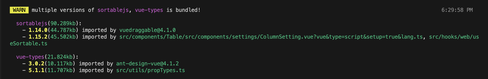
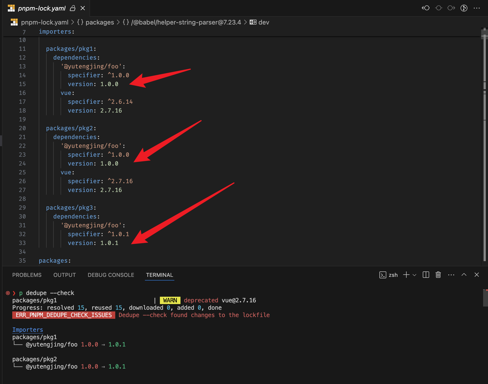

由于最近面试经常被问到这个问题（简历上写了），感觉答的时候不是很系统清晰，于是便有了这篇文章。

## 为啥对这个问题这么上心？

在上家公司最后一段时间是做前端工程基建相关的，不说是最有成长的一段时间，但绝对是最开心的一段时间。上来第一个任务是优化项目构建体积，项目之前是 webpack 写的，做技术升级之后迁移到了 vite，但是迁移后发现主 bundle 的体积增加了很多，后面也是采用了多个方法对体积进行优化：

- 去除重复依赖，有很多依赖被打包了多次，具体哪些包忘了，但是印象中 `pnpm.overrides` 很长
- 按需导入，组件库是 ant design vue based，版本挺低了，毕竟还是 vue2。我知道最新版已经支持 tree-shaking，不需要配置按需导入
- 选择合适的版本，例如我们项目目只用到了 paper.js 的核心功能，但是默认 paper 包 main 是指向 `dist/paper-full.js(451KB)` 你可以配置它指向 `dist/paper-core.js(394KB)`，
- 使用 importmap 将包从构建中分离，改为使用浏览器原生的 ESM 从 CDN 加载
- 对于一些还在使用 rollup + babel 打包的 package 使用 babel-runtime 避免重复打包 helper 代码
- 精准配置 browserslist，所有构建工具统一使用 package.json 中 browserslist 字段读取浏览器兼容目标版本
- 项目中同时使用了多个功能类型的 pkg，例如时间相关的 moment, dayjs, data-fns, 还有我记得生成二维码和处理 xlsx 的库也有多个，为了这个问题我写了个 cli: [find-similar-packages](https://github.com/tjx666/find-similar-packages)
- 通知其它部门同事不要把 node_modules 打包到 dist 里面，把 ant design 的 babel-runtime 升级到 @babel/runtime，反正就是说有些包打包很不规范
- ...

等等，离职混日子快半年了，暂时只能想起这些。

回到主题，在我所有的优化策略中，去除重复依赖减小打包体积的效果是占第二位的。第一位是 importmap，最简单的减小体积策略就是不打包。关于 importmap，有机会单独写一篇文章。

## 如何发现重复依赖？

下面介绍下我使用过的方法和工具。

### 直接看依赖分布图

对于一个在 3 年前应届时期就是 webpack 老鸟的我，第一步当然是装上一些构建分析工具来看看项目里面打包了哪些妖魔鬼怪。于是找下 vite 的 bundle 可视化工具，没找到，于是搜了搜 rollup 相关的插件，被我找到 [rollup-plugin-visualizer](https://github.com/btd/rollup-plugin-visualizer)。要咱说为什么 vite 能这么成功，兼容 rollup 插件很关键啊。当时我对 vite 其实一点都不熟，也没那么多 vite 插件，很多插件都是用 rollup 的，就非常佩服 vite 兼容 rollup 插件的这个设计。要问 rspack 和 turbopack 更看好谁？那肯定是 rspack。rspack 兼容 webpack 生态呀，看看 bun 和 deno 现在的流行趋势还不够说明问题吗？

我记得我当时分析我们公司那个项目的时候当时就发现打包了好几个 ant design vue，对于那些体积较大的依赖一眼就能看出来。然后可以试着过滤一些非常常用的第三方依赖，像 vue/vue-router/lodash 这些。

拿 github star 21k 的 [vue-vben-admin](https://github.com/vbenjs/vue-vben-admin) 做测试，本来想用网红项目 [elk](https://github.com/elk-zone/elk) 的，但是这个项目构建有点复杂，会构建好几次，我对 nuxt 也不熟，还是算了。


rollup-plugin-visualizer 这个插件建议用 5.8.3 版本，最新版过滤不太好用，参考 issue：[new Include and Exclude is hard to understand and use](https://github.com/btd/rollup-plugin-visualizer/issues/149)

### 基于 lockfile 分析的 cli

早在 [pnpm dedupe](https://pnpm.io/cli/dedupe) 出来之前，我一直用的是 [pnpm-deduplicate](https://github.com/ocavue/pnpm-deduplicate)，效果很直观：

```node
Package "@babel/core" wants ^7.17.10 and could get 7.18.2, but got 7.18.0
Package "@babel/core" wants ^7.15.5 and could get 7.18.2, but got 7.18.0
Package "@babel/core" wants ^7.7.5 and could get 7.18.2, but got 7.18.0
Package "@babel/generator" wants ^7.7.2 and could get 7.18.2, but got 7.18.0
Package "@babel/generator" wants ^7.18.0 and could get 7.18.2, but got 7.18.0
```

整挺好，但是和 pnpm 一样只要是基于 lockfile 分析的工具都有一个通病，就是无法区分开发依赖和源码依赖。在实际的 monorepo 项目中，你可能存在多个 app 需要构建，可能不同的 app 依赖了不同版本也会被扫描出来。

有时候为了确保某个重复依赖是否被干掉，你也可以直接去 pnpm-lock.yaml 里面搜索那个 package，还可以借助 `pnpm why` 去查看一个包是因为什么原因被安装的。

### 打包工具插件

最开始我搜到了 [duplicate-package-checker-webpack-plugin](https://github.com/darrenscerri/duplicate-package-checker-webpack-plugin)，但是我们项目用的是 vite，于是熟悉 vite 插件开发的机会来了，当时 unplugin 挺火，可以让你用 rollup 插件系统的钩子写跨构建工具的插件，于是在借鉴了前面提到的 webpack 插件和 chatgpt 的帮助下很快就写出了 [unplugin-detect-duplicated-deps](https://github.com/tjx666/unplugin-detect-duplicated-deps)。



#### 原理

面试经常被问到 webpack 插件是怎么工作的，其实 webpack 和其他它很多构建工具的插件的开发方式都一样，插件本质上就是去订阅构建工具暴露的扩展事件（或者说钩子），在回调编写你的扩展逻辑。

核心逻辑：

1. 获取每一个模块 id 解析后的文件绝对路径
2. 从文件当前目录往上找 package.json，确定这个模块是哪个包哪个版本引入的
3. 分析收集到的模块信息，对于那些同一个依赖出现了多个版本，则被视为有问题的依赖
4. 当有依赖被重复打包则输出有问题的依赖信息

第一步可以使用 rollup 的 resolveId 事件，输出错误信息可以在解析完所有依赖的任意钩子，例如 buildEnd。

#### 显示包的体积

只是列出了被重复打包的依赖，感觉对构建体积的影响不够直观，于是便借助 <https://bundlephobia.com/> 的 api 来获取依赖的体积并展示。其实我一直不太理解为啥用 [import cost](https://marketplace.visualstudio.com/items?itemName=wix.vscode-import-cost) 插件的人那么多，这玩意因为需要跑一次 webpack，所以又慢又吃资源，直接用 api 请求不香吗？

#### 如何预防再次出现重复依赖

最初借助这个插件把一些重复依赖干掉后，过了一段时间，发现又多了一些新的重复依赖。对于开发效率有极致追求的我，受不了自己再处理一遍，谁拉的 💩 让他自己去处理。当时有在做 ci check 的优化，于是说能不能把重复依赖检查加到 ci 上去。这是我在上家公司贡献的最后一个 pr 了。于是这个插件新增了一个选项 `throwErrorWhenDuplicated`，当设置为 true 时，出现重复依赖的时候构建进程便会退出。这个时候你可以有两种选择：

1. 通过排查重复依赖的原因，消除掉这个重复依赖
2. 通过 `ignore` 选型配置白名单


## 如何修复重复依赖？

### 声明版本号使用兼容性前缀

声明 vue 版本号有两种常见方式：

1. 带兼容性前缀（或者说通配符） `^2.7.14`
2. 使用固定版本号 `2.7.14`

问题场景：

项目中的 workspace packages 声明了 vue@^2.6.10 和 vue@^2.7.14，存在 pnpm-lock.yaml，项目中也确实安装了两个版本 vue2.6.10 和 vue2.7.14。

在使用兼容性前缀时修复方法：

删掉 lockfile, node_modules，重新 pnpm install，这样 pnpm 只会安装 vue@2.7.14。

注意我前面提到的要求：

1. 删除 lockfile，因为 lockfile 的作用就是锁定版本
2. 删除 node_modules，因为 pnpm 貌似在 node_modules 存在时，会直接复用当前 node_modules 安装的依赖版本作为解析的版本，具体看 issue：[doesn't resolve to latest satisfied version](https://github.com/pnpm/pnpm/issues/7543)

虽说这样可以修复安装多个版本的问题，但是删除 lockfile 会导致依赖升级，往往可能会引入新的问题，项目越大越容易出问题。可能这也是为什么 pnpm 在 v8 的时候对于直接依赖采取 [lowest 策略](https://twitter.com/pnpmjs/status/1693707270897517022) 虽然后面改回去了。

小技巧：

```bash
# monorepo 项目删除所有 node_modules
alias rmpkgs="rm -rf node_modules && pnpm -r exec rm -rf node_modules"
```

关于通配符这里再插一嘴，不是所有版本都适合使用 `^` 前缀，像 typescript 建议使用 `~`，typescript 是一个典型的不遵守 semver 版本号的项目，minor 版本号变化也会引入破坏性变更。

### pnpm update -r

如果重复安装的依赖是 workspace packages 的直接依赖导致的，通过升级依赖可以解决。

### pnpm dedupe

`pnpm update -r`，可以解决 workspace packages 的直接依赖问题，但是不能解决依赖的依赖导致的问题。

这是 pnpm 自带的依赖去重命令，我在上家公司的时候这个功能还没出。



如果只是想对重复依赖做检查而不是直接修改 lockfile，可以使用 `--check` 参数，甚至可以把这一步加到 ci 的 pnpm install 之前，但是我感觉不太实用，这会检查到开发依赖，开发依赖重复其实一般是不 care 的。

### 使用 peerDependencies

之前参与团队会议的时候，听到同事把 peerDependencies 翻译为`对等依赖`，听的我稀里糊涂，问了下才知道说的是 peerDependencies，我觉得这翻译确实离谱。

当我们给我们的 package 添加一个依赖 dep 时，如果安装这个 package 的时候，大概率 dep 已经被 app 安装了，那么我们应该声明这个 dep 为 dependencies。这种依赖往往是某个生态的核心依赖，例如 vue, react, @babel/core, type-fest, vite 等。

如果我们声明这些依赖为 dependencies，那么由于不同的 package 声明的版本不一样，由于 lockfile 的锁定作用，有可能导致安装多个版本。

如果使用 peerDependencies，由于所有的 packages 依赖的都是 app 安装的 dep，所有不会有重复依赖的问题

### 锁版本

`pnpm dedupe` 可以在遵守兼容性前缀的前提下把多个版本升到一个最高的版本，但是对于像 1.x, 2.x 这种不符合兼容性要求的情况就无能为力了。这两年 ESM 大行其道，很多包就因为迁移到 ESM，就发了大版本。

除了大版本这种情况，还有改包名的情况，一个典型的例子 `babel-core` 和 `@babel/core`。

我们可以通过配置去锁定整个项目中某个依赖的版本，不同的包管理器方法不太一样：

- [pnpm.overrides](https://pnpm.io/package_json#pnpmoverrides)
- [npm overrides](https://docs.npmjs.com/cli/v9/configuring-npm/package-json#overrides)
- [yarn resolutions](https://classic.yarnpkg.com/en/docs/selective-version-resolutions)

```json
{
  "pnpm": {
    "overrides": {
      "vue": "2.7.14",
      "babel-core": "npm:@babel-core7.24.3"
    }
  }
}
```

我在团队的时候 `pnpm.overrides` 有个 [bug](https://github.com/pnpm/pnpm/issues/4214) 不能锁定 peerDependencies 的版本，当时是通过手写 `.pnpmfile` 钩子去[解决](https://github.com/pnpm/pnpm/issues/4214#issuecomment-1578004504)这个问题的，不过现在已经[修复](https://github.com/pnpm/pnpm/issues/6759)了。

这里顺便分享个故事：我虽然是在编辑器团队，但是很少参与编辑器本身的功能迭代，我记得是 3 年前第一次跑编辑器项目的时候那次安装依赖贼耗时，开了代理也没用。原因是项目中依赖了 node-canvas, puppeteer 之类包需要下载很大的二进制文件，但是实际上项目根本用不到这几个包。三年后我再次参与这个项目的迭代，还是这么慢，我就直接截张图发群里开喷了。我的性格就是这样，之前面试的时候还被面试官说我有点强势... 喷归喷，我还是把这个问题给解决了。

首先这几个依赖我们项目里面依赖到了，但实际上是用不到的，但是我们当时没法推动别的团队去把那几个下载贼慢的依赖从 dependencies 里面干掉。当时查阅资料发现了：[a way to ignore packages](https://github.com/yarnpkg/yarn/issues/4611#issuecomment-584903011)，原理就是把这几个不需要安装的包锁定到一个占位包：

```json
{
  "resolutions": {
    "node-canvas": "https://registry.yarnpkg.com/@favware/skip-dependency/-/skip-dependency-1.0.2.tgz"
  }
}
```

后面了解到有 `.pnpmfile.cjs` 这个东西我就直接在那里面去 delete 掉那几个依赖了，但是 `.pnpmfile.cjs` 其实也有个挺无语的 bug：[.pnpmfile change not trigger resolution](https://github.com/pnpm/pnpm/issues/6726)。上个月才修复的。

要不是天天和 pnpm 做斗争，我也想不到这玩意有这么多 bug。pnpm 纵然有很多 bug，某些框架如 electron 和 vsce 对 pnpm 这种基于链接的包管理器兼容性不好。但我还是很喜欢 pnpm，安装快，省空间，node_modules 下结构清晰，提供了非常多实用的扩展选项，还可以编写 `.pnpmfile.cjs` 修改安装逻辑，等等。

在 importmap 中有个 `scope` 字段其实也可以起到锁定版本的作用：

```json
{
  "imports": {
    "vue": "https://esm.dancf.com/npm:vue@2.7.14/dist/vue.esm.js"
  },
  "scopes": {
    "https://esm.dancf.com/": {
      "axios": "https://esm.dancf.com/npm:axios@1.3.5/dist/axios.min.js",
      "js-cookie": "https://esm.dancf.com/npm:js-cookie@3.0.1/dist/js.cookie.mjs",
      "uuid": "https://esm.dancf.com/npm:uuid@7.0.1/dist/esm-browser/index.js"
    }
  }
}
```

## 总结

分析重复打包的源码依赖建议使用插件：[unplugin-detect-duplicated-deps](https://github.com/tjx666/unplugin-detect-duplicated-deps)。

修复重复打包依赖，一般情况可以通过 `pnpm update` + `pnpm dedupe` 来自动修复，对于跨大版本，换包名，或者其它很难解决的情况建议直接上 `pnpm.overrides` 锁定版本。

建议开启 [unplugin-detect-duplicated-deps](https://github.com/tjx666/unplugin-detect-duplicated-deps) 的 `throwErrorWhenDuplicated` 选项将其作为 ci check 来预防再次出现依赖重复打包。
